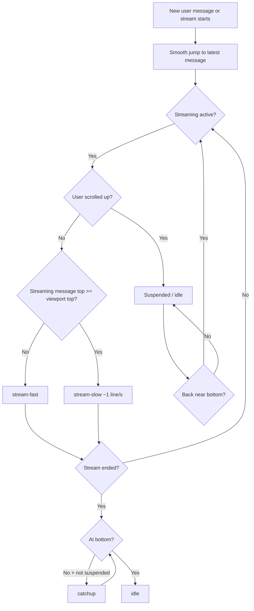

# Chat auto-scroll behavior

The chat viewport auto-scroll logic is implemented as a small state machine so streaming replies remain readable while still respecting user intent.

## State model

- `stream-fast`: active while assistant streaming is in progress and the streaming message has **not** yet reached the top edge of the viewport.
- `stream-slow`: active while assistant streaming is in progress and the streaming message has reached/overlapped the top edge.
- `catchup`: active after streaming finishes when auto-scroll is not suspended and the viewport is still away from the bottom.
- `idle`: no auto-scroll movement.
- `suspended`: user override flag (set when user scrolls upward against auto-scroll).

## Behavioral contract

1. **Send/stream start jump**: on new user message and on assistant stream start, the viewport jumps near-instantly with smooth scroll to the newest message.
2. **Fast follow while room remains**: while streaming and the top of the active assistant message is below the viewport top, auto-scroll runs quickly to keep tokens visible at the bottom.
3. **Slow follow for long responses**: once that message reaches the top edge, auto-scroll throttles to approximately one line per second.
4. **Suspend on upward user scroll**: any upward manual scroll gesture during active streaming suspends auto-scroll.
5. **Resume near bottom**: auto-scroll resumes once the user returns to within about one text line of the bottom.
6. **Post-stream catch-up**: when streaming ends, auto-scroll does not stop until either:
   - bottom is reached, or
   - user suspension is active.
7. **Journal-open behavior**:
   - opening **today's journal** performs a near-instant smooth jump to the bottom once the messages render, then remains idle until a new stream starts.
   - opening a **past journal** keeps auto-scroll fully disabled.

## Mermaid flow

