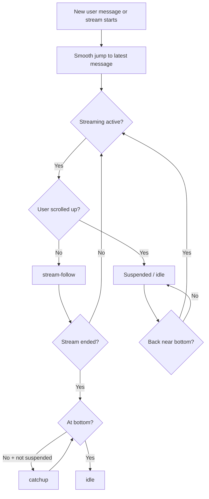

# Chat auto-scroll behavior

The chat viewport auto-scroll logic is implemented as a small state machine so streaming replies remain readable while still respecting user intent.

## State model

- `stream-follow`: active while assistant streaming is in progress; the viewport continuously follows new streamed content.
- `catchup`: active after streaming finishes when auto-scroll is not suspended and the viewport is still away from the bottom.
- `idle`: no auto-scroll movement.
- `suspended`: user override flag (set when user scrolls upward against auto-scroll).

## Behavioral contract

1. **Send/stream start jump**: on new user message and on assistant stream start, the viewport begins a near-instant, smooth **regressive** scroll-to-bottom (faster when farther away, decelerating near the end; target ~1-2s even on long journals).
2. **Continuous follow while streaming**: while streaming is active, auto-scroll follows at a pace that keeps up with token output so the stream should not finish above bottom unless the user interrupts.
3. **Suspend on upward user scroll**: any upward manual scroll gesture during active streaming suspends auto-scroll.
4. **Resume near bottom**: auto-scroll resumes once the user returns to within about one text line of the bottom.
5. **Post-stream catch-up**: when streaming ends, auto-scroll does not stop until either:
   - bottom is reached, or
   - user suspension is active.

   If streaming ends while the viewport is still above bottom and not suspended, auto-scroll continues in catch-up mode until the bottom end condition is met.
6. **Journal-open behavior**:
   - opening **today's journal** performs a near-instant smooth jump to the bottom once the messages render, then remains idle until a new stream starts.
   - opening a **past journal** keeps auto-scroll fully disabled.

## Mermaid flow

