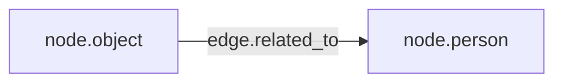

# Knowledge Interface gRPC API and Graph Delta Contract

This document describes what clients must send to `IngestGraphDelta` and `InitializeUserGraph`.

## Core rule

A graph delta is accepted only when it is schema-valid:

- node and edge types must exist in the canonical schema
- node/edge properties must exist on the type or inherited parent type
- edge endpoints must match one of the schema edge rules

## ID format requirements

Client-provided IDs are **domain IDs**, not Memgraph-internal IDs.

- IDs must be lowercase and dot-separated
- Allowed chars: `a-z`, `0-9`, `.`, `_`, `-`
- Examples:
  - `person.alex`
  - `block.note.2026-02-25`
  - `assistant.user-17`

Invalid IDs return `InvalidArgument` with detailed messages.

## Type mapping from payload labels

`EntityNode.labels` and `BlockNode.labels` are interpreted as schema node type hints.

- Entity with labels `Entity`, `Person` -> `node.person`
- Entity with labels `Entity`, `Object` -> `node.object`
- Block with label `Block` -> `node.block`

If only base label is sent, base type is used (`node.entity` / `node.block`).

## Required/allowed properties

Properties are checked against schema property definitions including inheritance.

Example:

- `node.person` inherits `node.entity`
- if `node.entity` defines `name`, then `node.person` can use `name`

## Edge endpoint validation

Edges are validated with schema rules (`knowledge_graph_schema_edge_rules`).

For example, a `RELATED_TO` edge is valid only if a matching rule exists for source and target node types (or their ancestors).

## Qdrant projection contract

Qdrant stores a projection of all `node.block` nodes.

- point id = block id
- payload includes `block_id`, `universe_id`, `user_id`, `visibility`, `text`, `root_entity_id`, `entity_ids`
- updating a block rewrites the corresponding point (new embedding + payload)

## Transaction behavior

Writes are coordinated across Memgraph and Qdrant:

1. Memgraph transaction starts
2. Delta is written to Memgraph transaction
3. Qdrant upserts are applied
4. Memgraph transaction commits

Failure behavior:

- If steps 1-3 fail: Memgraph is rolled back
- If step 4 fails: newly upserted Qdrant points are deleted as compensation

## Example `IngestGraphDelta` payload shape

Minimal valid delta for one person + one block + one edge:

- `entities[0].id = person.alex`
- `entities[0].labels = ["Entity", "Person"]`
- `entities[0].properties` contains `name`
- `blocks[0].id = block.alex.root`
- `blocks[0].properties` contains `text`
- `edges[0].edge_type = RELATED_TO`

For interactive request prototyping use `grpcui -plaintext localhost:50051`.
