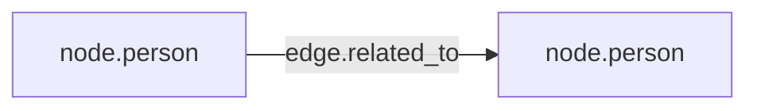

# Knowledge Interface gRPC API and Graph Delta Contract

This document describes what clients must send to `UpsertGraphDelta` and `InitializeUserGraph`.

## Core rule

A graph delta is accepted only when it is schema-valid:

- node and edge types must exist in the canonical schema
- node/edge properties must exist on the type or inherited parent type
- edge endpoints must match one of the schema edge rules

## ID format requirements

Client-provided IDs are **domain IDs**, not Memgraph-internal IDs.

- IDs must be RFC 4122 UUID strings
- Example: `550e8400-e29b-41d4-a716-446655440000`
- Examples:
  - `550e8400-e29b-41d4-a716-446655440001`
  - `550e8400-e29b-41d4-a716-446655440002`

Invalid IDs return `InvalidArgument` with detailed messages.

## Type mapping

Request now includes `universes[]` (id + name) at the top level; `universe_id`/`universe_name` are no longer root fields.
Entities may omit `universe_id`, in which case the service defaults to the Real World universe (`9d7f0fa5-78c1-4805-9efb-3f8f16090d7f`).
This implicit universe assignment also satisfies the `IS_PART_OF` relationship rule during validation.

Clients provide `type_id` (for example `node.person` or `node.block`).
The server resolves and writes the full label chain from schema inheritance (for example `:Entity:Person:Friend`).

## Required/allowed properties

Properties are checked against schema property definitions including inheritance.

Example:

- `node.person` inherits `node.entity`
- if `node.entity` defines `name`, then `node.person` can use `name`

## Edge endpoint validation

Edges are validated with schema rules (`knowledge_graph_schema_edge_rules`).

For example, a `RELATED_TO` edge is valid only if a matching rule exists for source and target node types (or their ancestors).

- For `PRIVATE` edge writes, endpoint nodes may be either `PRIVATE` or `SHARED` (same `user_id` still required).

## Qdrant projection contract

Qdrant stores a projection of all `node.block` nodes.

- point id = block id
- payload includes `block_id`, `universe_id`, `root_entity_id`, `user_id`, `visibility`, `text`, `block_level`
- updating a block rewrites the corresponding point (new embedding + payload)

## Transaction behavior

Writes are coordinated across Memgraph and Qdrant:

1. Memgraph transaction starts
2. Delta is written to Memgraph transaction
3. Qdrant upserts are applied
4. Memgraph transaction commits

Failure behavior:

- If steps 1-3 fail: Memgraph is rolled back
- If step 4 fails: newly upserted Qdrant points are deleted as compensation

## Example `UpsertGraphDelta` payload shape

Minimal valid delta for one person + one block + explicit edges:

- `entities[0].id = 550e8400-e29b-41d4-a716-446655440001`
- `entities[0].type_id = node.person`
- `entities[0].properties` contains `name`
- `blocks[0].id = 550e8400-e29b-41d4-a716-446655440002`
- `blocks[0].type_id = node.block`
- `blocks[0].properties` contains `text`
- `edges[0].edge_type = DESCRIBED_BY` (for entity -> block relationship)
- `SUMMARIZES` edges can target new blocks from existing parent blocks; root metadata resolves from the existing parent chain.
- `edges[1].edge_type = RELATED_TO` (optional semantic edge)

For interactive request prototyping use `grpcui -plaintext localhost:50051`.

Visibility values are accepted as provided per node/edge; ingestion does not enforce request-level visibility equality across all records.
