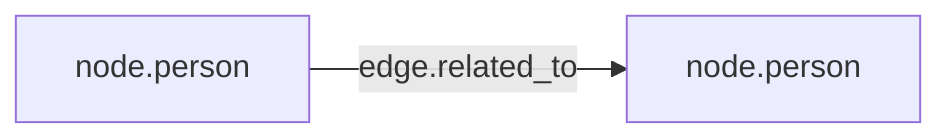

# Knowledge Interface gRPC API and Graph Delta Contract

This document describes what clients must send to `UpsertGraphDelta` and
`GetUserInitGraph`, plus how to query `FindEntityCandidates`, `GetEntityContext`, and `GetExtractionSchemaContext`.

## Core rule

A graph delta is accepted only when it is schema-valid:

- node and edge types must exist in the canonical schema
- node/edge properties must exist on the type or inherited parent type
- edge endpoints must match one of the schema edge rules

Validation is split into:

- **request payload rules** (type/property/rule checks on records supplied in the request)
- **target graph state rules** (relationship cardinality checks against the graph state after applying the upsert)

This means block updates can rely on existing `DESCRIBED_BY`/`SUMMARIZES` parent edges already present in the graph; those edges do not need to be resubmitted unless they are changing.

## ID format requirements

Client-provided IDs are **domain IDs**, not Memgraph-internal IDs.

- IDs must be RFC 4122 UUID strings
- Example: `550e8400-e29b-41d4-a716-446655440000`
- Examples:
  - `550e8400-e29b-41d4-a716-446655440001`
  - `550e8400-e29b-41d4-a716-446655440002`

Invalid IDs return `InvalidArgument` with detailed messages.

## Type mapping

Request now includes `universes[]` (id + name) at the top level; `universe_id`/`universe_name` are no longer root fields.
`UpsertGraphDeltaRequest` has no root-level `user_id` or `visibility`; those are provided per universe/entity/block/edge record.
Entities may omit `universe_id`, in which case the service defaults to the Real World universe (`9d7f0fa5-78c1-4805-9efb-3f8f16090d7f`).
This implicit universe assignment also satisfies the `IS_PART_OF` relationship rule during validation.


Clients provide `type_id` (for example `node.person` or `node.block`).
The server resolves and writes the full label chain from schema inheritance (for example `:Entity:Person:Friend`).

## Required/allowed properties

Properties are checked against schema property definitions including inheritance.
Global `node`/`edge` property definitions also apply to every node/edge subtype without duplicating definitions per concrete type.

Example:

- `node.person` inherits `node.entity`
- if `node.entity` defines `name`, then `node.person` can use `name`
- if `edge` defines `confidence`/`status`/`provenance_hint`, then every edge type (for example `RELATED_TO`, `LOCATED_AT`) must provide them

Internal graph metadata fields `created_at` and `updated_at` are managed by Memgraph triggers and must not be sent by clients in `UpsertGraphDelta`.

## Edge endpoint validation

Edges are validated with schema rules (`knowledge_graph_schema_edge_rules`).

For example, a `RELATED_TO` edge is valid only if a matching rule exists for source and target node types (or their ancestors).

- For `PRIVATE` edge writes, endpoint nodes may be either `PRIVATE` or `SHARED`; caller services enforce RBAC/user boundaries.
- `UpsertGraphDelta` may include mixed-user node/edge records in a single request; ownership policies are enforced by upstream caller services.
- Graph-state cardinality is enforced after applying the delta:
  - `(:Entity)-[:DESCRIBED_BY]->(:Block)` is enforced as 1-to-1 cardinality (an entity may not have more than one outgoing `DESCRIBED_BY`, and each block still has one incoming parent edge).
  - `(:Universe)-[:DESCRIBED_BY]->(:Block)` is also enforced as 1-to-1 (a universe may not have more than one outgoing `DESCRIBED_BY`).
  - `(:Block)-[:SUMMARIZES]->(:Block)` is 1-to-N: a parent block may summarize many child blocks, while each child block still has exactly one incoming parent edge (`DESCRIBED_BY` or `SUMMARIZES`).


```mermaid
flowchart LR
  A[node.person]
  B[node.person]
  A -->|edge.related_to| B
```

## Qdrant projection contract

Qdrant stores a projection of all `node.block` nodes.

- point id = block id
- payload includes `block_id`, `universe_id`, `root_entity_id`, `user_id`, `visibility`, `text`, `block_level`
- updating a block rewrites the corresponding point (new embedding + payload)

## Transaction behavior

Writes are coordinated across Memgraph and Qdrant:

1. Memgraph transaction starts
2. Delta is written to Memgraph transaction
3. Qdrant upserts are applied
4. Memgraph transaction commits

Failure behavior:

- If steps 1-3 fail: Memgraph is rolled back
- If step 4 fails: newly upserted Qdrant points are deleted as compensation

## Example `UpsertGraphDelta` payload shape

Minimal valid delta for one person + one block + explicit edges:

- `entities[0].id = 550e8400-e29b-41d4-a716-446655440001`
- `entities[0].type_id = node.person`
- `entities[0].properties` contains `name`
- `blocks[0].id = 550e8400-e29b-41d4-a716-446655440002`
- `blocks[0].type_id = node.block`
- `blocks[0].properties` contains `text`
- `edges[0].edge_type = DESCRIBED_BY` (for entity -> block relationship)
- `SUMMARIZES` edges can target new blocks from existing parent blocks; root metadata resolves from the existing parent chain.
- `edges[1].edge_type = RELATED_TO` (optional semantic edge)

For interactive request prototyping use `grpcui -plaintext localhost:50051`.


Visibility values are accepted as provided per node/edge; scope is carried per universe/entity/block/edge (no top-level request scope fields).


## GetUpsertGraphDeltaJsonSchema

`GetUpsertGraphDeltaJsonSchema` returns a JSON Schema document for the `UpsertGraphDeltaRequest` payload so clients can pre-validate ingestion payloads before sending gRPC writes.

### Full request/response schema

```proto
message GetUpsertGraphDeltaJsonSchemaRequest {}

message GetUpsertGraphDeltaJsonSchemaReply {
  string json_schema = 1;
  optional string schema_id = 2;
  optional string draft = 3;
  optional string version = 4;
}
```

Response behavior:

- `json_schema` contains a JSON Schema document string.
- `schema_id` identifies the canonical schema document URI.
- `draft` reports the JSON Schema draft the response uses.
- `version` reports the schema payload version.

## GetExtractionSchemaContext

`GetExtractionSchemaContext` returns a normalized, deterministic, LLM-focused view of the schema. Use it when a caller needs:

- inheritance chains flattened per entity type
- allowed outgoing and incoming edge expansions per entity type
- stable ordering for deterministic prompt construction and cache keys

### Endpoint purpose

- **Primary**: build extraction prompts grounded in currently active schema types and edge rules.
- **Secondary**: expose a compact, client-friendly structure without requiring each client to resolve inheritance and edge endpoints itself.

### Full request schema

```proto
message GetExtractionSchemaContextRequest {
  optional bool include_edge_properties = 1;
  optional bool include_inactive = 2;
  string user_id = 3;
}
```

Request behavior:

- `include_edge_properties`
  - currently reserved for richer edge payload expansion
  - omitted/`null` behaves as `false`
- `include_inactive`
  - includes inactive types/rules when `true`
  - omitted/`null` behaves as `false`
- `user_id`
  - required
  - used to include caller-visible universes (`PRIVATE` for that user + `SHARED`)

### Full response schema

```proto
message AllowedEdge {
  string edge_type_id = 1;
  string edge_name = 2;
  string edge_description = 3;
  string other_entity_type_id = 4;
  string other_entity_type_name = 5;
  optional uint32 min_cardinality = 6;
  optional uint32 max_cardinality = 7;
}

message ExtractionEntityType {
  string type_id = 1;
  string name = 2;
  string description = 3;
  repeated string inheritance_chain = 4;
  repeated AllowedEdge outgoing_edges = 5;
  repeated AllowedEdge incoming_edges = 6;
}

message ExtractionUniverse {
  string id = 1;
  string name = 2;
  optional string described_by_text = 3;
}

message GetExtractionSchemaContextReply {
  repeated ExtractionEntityType entity_types = 1;
  optional string prompt_context_markdown = 2;
  repeated ExtractionUniverse universes = 3;
}
```

Response behavior:

- `entity_types` are sorted by `type_id` and exclude the abstract `node` type.
- `outgoing_edges` and `incoming_edges` are sorted deterministically by edge type and counterpart type.
- `inheritance_chain` is flattened root-first (for example `node.entity -> node.person`).
- `prompt_context_markdown` is derived from `entity_types` and can be embedded directly in prompts.
- `universes` are sorted by `id` and include optional root `DESCRIBED_BY` text so extractors can distinguish real-world vs fictional context.

### Example response (small schema subset)

```json
{
  "entityTypes": [
    {
      "typeId": "node.person",
      "name": "Person",
      "description": "A human person",
      "inheritanceChain": ["node.entity", "node.person"],
      "outgoingEdges": [
        {
          "edgeTypeId": "edge.related_to",
          "edgeName": "RELATED_TO",
          "edgeDescription": "Generic relationship",
          "otherEntityTypeId": "node.organization",
          "otherEntityTypeName": "Organization"
        }
      ],
      "incomingEdges": []
    }
  ],
  "promptContextMarkdown": "# Extraction schema context\n..."
}
```

### Guidance for LLM prompt usage

- Prefer `entity_types` as the source of truth for programmatic prompt assembly and validation.
- Use `prompt_context_markdown` for fast prompt bootstrapping when you need a readable schema summary.
- Inject only relevant entity types/edges for the current extraction task to reduce token usage.
- Re-fetch when schema might have changed; ordering is deterministic so prompt diffs are meaningful.

## ListEntitiesByType

`ListEntitiesByType` returns paginated entities for a specific type and requester visibility scope.

### Request schema

```proto
message ListEntitiesByTypeRequest {
  string user_id = 1;
  string type_id = 2;
  optional uint32 page_size = 3;
  optional string page_token = 4;
}
```

- `user_id` (required): requester identity.
- `type_id` (required): entity type id filter (for example `node.person`).
- `page_size` (optional): requested page size; service clamps into `[1, 200]` and defaults to `50`.
- `page_token` (optional): opaque forward cursor currently encoded as a decimal offset string.

### Response schema

```proto
message ListEntitiesByTypeItem {
  string id = 1;
  string name = 2;
  optional string updated_at = 3;
  optional string description = 4;
  optional double score = 5;
}

message ListEntitiesByTypeReply {
  repeated ListEntitiesByTypeItem entities = 1;
  optional string next_page_token = 2;
  optional uint32 total_count = 3;
}
```

- `entities[]`: ordered page of matching entities.
- `next_page_token`: present when another page is available.
- `total_count`: running count (`offset + entities.len`) for the current page window.

### Visibility semantics

Results include entities visible to the requester:

- private entities where `entity.user_id == request.user_id`
- shared entities where `visibility == SHARED`

The same visibility scope is enforced for description blocks and relationship-derived ranking signals.

### Ranking and ordering factors

Items are ranked with a relevance score and then ordered by:

1. computed relevance (descending)
2. `updated_at` (descending)
3. `id` (ascending)

Current relevance combines:

- recency weight from `updated_at`
- block volume (`DESCRIBED_BY` + `SUMMARIZES` depth-adjusted evidence)
- ownership boost for requester-owned entities
- relationship neighborhood volume

`score` is currently reserved/optional in the public response payload.

### Pagination behavior

- First page: omit `page_token`.
- Next page: send the previous `next_page_token`.
- Cursors are forward-only and represent the backing query offset.
- Invalid cursor format returns `INVALID_ARGUMENT`.

### Compact example

```json
{
  "user_id": "user-123",
  "type_id": "node.person",
  "page_size": 2,
  "page_token": "0"
}
```

```json
{
  "entities": [
    {
      "id": "e-1",
      "name": "Ada Lovelace",
      "updated_at": "2026-01-01T00:00:00Z",
      "description": "English mathematician"
    },
    {
      "id": "e-2",
      "name": "Charles Babbage"
    }
  ],
  "next_page_token": "2",
  "total_count": 2
}
```

## FindEntityCandidates

`FindEntityCandidates` returns candidate entities by combining lexical name matching and
semantic similarity over `node.block` text.

### Request schema

- `names[]`: free-form candidate names (case-insensitive; trimmed and normalized)
- `potential_type_ids[]`: optional entity type filter (`node.person`, `node.company`, ...)
- `short_description`: optional semantic hint text (embedded and searched against Qdrant)
- `user_id`: required requester scope
- `limit`: optional maximum result count

At least one non-empty `names[]` value or a non-empty `short_description` is required.

### Response schema

Each `EntityCandidate` includes:

- `entity_id`
- `entity_name`
- `described_by_text` (best available lowest block-level description, if present)
- `score` (combined lexical + semantic ranking score)
- `matched_name` / `matched_alias` (best-effort matched tokens)
- `entity_type_id`

### Matching semantics

- Name score is computed from normalized `names[]` against entity `name` and `aliases`.
- Semantic score comes from Qdrant block similarity and is weighted by block depth:
  - `weighted = raw_similarity * (1 / (1 + block_level))`
  - root description blocks (`block_level = 0`) contribute most.
- Entity hits are deduplicated by `entity_id` across lexical and semantic paths.
- Final score is combined as:
  - `0.55 * name_score + 0.45 * weighted_semantic_score`
- Results are sorted descending by final score and truncated by `limit` when provided.


## GetEntityContext

`GetEntityContext` is a schema-driven read contract for entity context hydration.

> ⚠️ **Breaking change (pre-launch):** `GetEntityContextReply.entity_properties` and `EntityContextBlock.properties` now use `map<string, string>` instead of `PropertyScalarValue` so JSON clients receive flat scalar maps without oneof-wrapper ambiguity.

### Request schema

```proto
message GetEntityContextRequest {
  string entity_id = 1;
  string user_id = 2;
  uint32 max_block_level = 3;
}
```

- `entity_id`: target entity UUID
- `user_id`: caller user scope
- `max_block_level`: maximum `block_level` depth to include (`0..32`; service clamps larger values to `32`)

### Response schema

```proto
message GetEntityContextReply {
  EntityContextCore entity = 1;
  map<string, string> entity_properties = 2;
  repeated EntityContextBlock blocks = 3;
  repeated EntityContextNeighbor neighbors = 4;
}
```

- `entity`: core fields (`id`, `type_id`, `user_id`, `visibility`) plus `name`, `aliases`, `created_at`, and `updated_at`.
- `entity_properties`: additional flat scalar properties as string values (`{ "key": "value" }`) excluding `name`, `aliases`, `created_at`, and `updated_at`.
- `blocks[]`: typed block entries (`id`, `type_id`, `block_level`) plus root-level `text`, `created_at`, `updated_at`, optional `parent_block_id`, additional `properties` (`map<string, string>`), and block-level `neighbors`.
- `neighbors[]`: outgoing and incoming entity neighbors with edge metadata (`direction`, `edge_type`, `properties`) where `properties` is a flat `map<string, string>`, plus `other_entity` (`id`, optional `description`, optional `name`).

### Block level semantics

- `block_level = 0`: the root block directly connected by `DESCRIBED_BY` from the entity.
- `block_level = N (> 0)`: a block reached in `N` `SUMMARIZES` hops from the root block.
- Depth filtering is inclusive (`block_level <= max_block_level`).
- The API returns blocks ordered by `block_level ASC`, then by block id.

### Neighbor direction semantics

- `OUTGOING`: returned for `(entity)-[edge]->(other_entity)`.
- `INCOMING`: returned for `(other_entity)-[edge]->(entity)`.
- Results include both directions and preserve edge metadata (`edge_type`, `properties`) while resolving `other_entity.description` from that entity's `DESCRIBED_BY` block text when available. `other_entity.name` is also returned from the neighbor entity node when present. The same shape applies to block-level neighbors (`blocks[].neighbors[]`).

### Access policy behavior

- Entity, block, neighbor entity, and edge records are filtered with the same visibility policy:
  - visible when `user_id == requester`
  - or when `visibility == SHARED`
- If the target entity is not visible/found under that policy, the RPC returns an error (`entity not found or inaccessible`).

### `grpcui` example

```bash
grpcui -plaintext localhost:50051
```

Example JSON request payload:

```json
{
  "entityId": "550e8400-e29b-41d4-a716-446655440010",
  "userId": "u-123",
  "maxBlockLevel": 2
}
```
