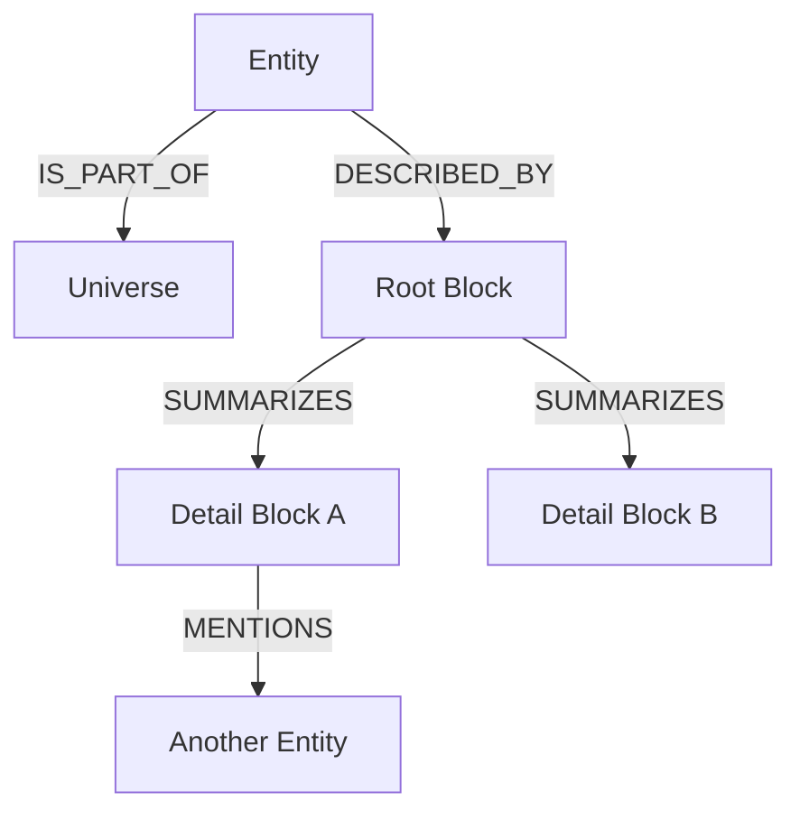
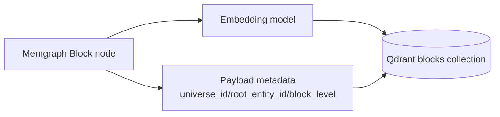

# Knowledge Graph Schema (System-wide)

This document defines the shared world-model schema used across Exobrain services.

## Core concept

- Entities are lightweight world objects (`Entity` + sublabels).
- Blocks are the narrative surface (`Block` nodes with text).
- `DESCRIBED_BY` edges are explicit graph edges from `Entity` to `Block` (client-specified).
- Root blocks can fan out into deeper details (`SUMMARIZES`) as a DAG.
- Blocks cross-link entities (`MENTIONS`) to support retrieval + backlinks.

## Entity-to-block structure

## Invariants

- Every `Entity` has exactly one `IS_PART_OF` edge to `Universe`.
- `DESCRIBED_BY` is used when a block directly describes an entity; higher-level summary blocks can omit it.
- `SUMMARIZES` forms a DAG (no cycles).
- World semantics should prefer explicit edge types over excess properties.

## Entity subtype constraints

The direct children of `node.entity` are intentionally fixed:

- `node.person`
- `node.group`
- `node.institution`
- `node.place`
- `node.object`
- `node.concept`
- `node.species`
- `node.event`

`node.task` remains a subtype of `node.event` (not a direct child of `node.entity`).

## Starter node labels

- `Universe`
- `Entity` (+ starter sublabels like `Person`, `Group`, `Institution`, `Place`, `Object`, `Concept`, `Species`, `Event`, `Task`)
- `Block` (+ optional `Quote`)

## Starter edge set

- Scoping/content: `IS_PART_OF`, `DESCRIBED_BY`, `SUMMARIZES`, `MENTIONS`
- General fallback: `RELATED_TO`
- Spatial/containment: `AT`, `LIES_IN`, `CONTAINS`
- Social: `KNOWS`, `MEMBER_OF`, `AFFILIATED_WITH`
- Event/task: `PARTICIPATED_IN`, `INVOLVES`, `BEFORE`, `CAUSES`, `ASSIGNED_TO`, `DONE_FOR`, `DEPENDS_ON`
- Classification/identity: `ABOUT`, `INSTANCE_OF`, `ALSO_KNOWN_AS`, `SAME_AS`

## Trust metadata

Edges may include:
- `confidence: float`
- `status: asserted | disputed | falsified`
- `context: string`

Blocks may include editorial trust hints:
- `confidence`
- `status`

## Vector store representation (Qdrant)

`Block` nodes are embedded into a `blocks` collection. The graph remains source-of-truth.

Required payload fields:
- `block_id`, `universe_id`, `root_entity_id`, `text`, `block_level`

## Universe semantics

- Universe membership is primarily a filtering/context mechanism.
- Entity/Block IDs are expected to be globally unique across universes.
- Cross-universe edges are valid and can encode semantic links between real-world concepts and fictional instances.
- Intended modeling pattern: a real-world `Entity:Concept` (for example, Darth Vader as a character concept) may connect via `INSTANCE_OF` to a fictional-universe `Entity:Person`.

## Label fields in ingestion payloads

- Clients provide `type_id` values for entities/blocks in graph upserts.
- The knowledge-interface resolves inheritance chains from schema and applies full Memgraph label sets internally (for example `:Entity:Person:Friend`).

## Client ID conventions

- IDs are client-provided domain IDs (not Memgraph internal IDs).
- Use RFC 4122 UUIDs for all node IDs (including Universe, Entity, and Block).
- Allowed characters: `a-z`, `0-9`, `.`, `_`, `-`.
